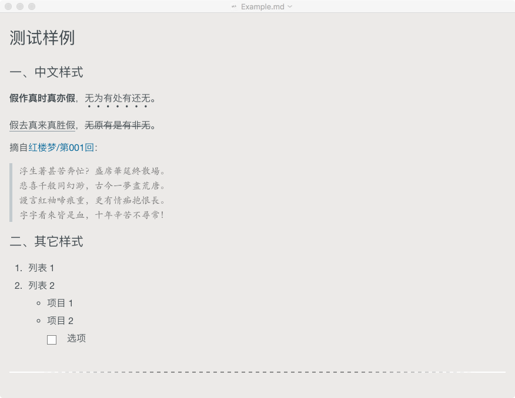

# README
**Hanzi** (Chinese: 汉字) is a customized theme for [Typora](https://typora.io/) markdown editor, which is optimized for Chinese typeface.

Features:

* customize CSS to follow Chinese typeface traditions, including `<em>`, `<blockquote>`, etc; 
* include code syntax highlight;

## Screenshot

## Install

Download `theme/hanzi.css` and put into the Typora Theme Folder.

See [Typora Documents](http://theme.typora.io/doc/).

## Acknowledgements

Hanzi theme uses [zmmbreeze/Entry.css](https://github.com/zmmbreeze/Entry.css).
